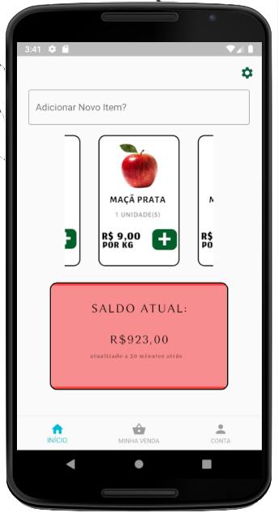
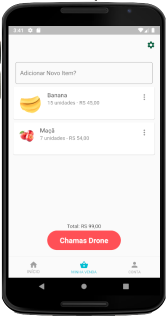
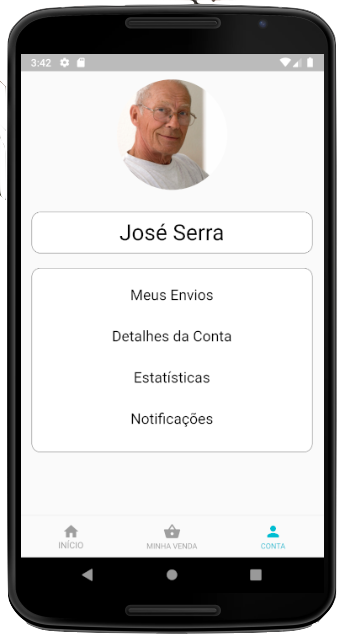

# FOODrone

Aplicativo mobile criado para SheHacksBR 2021 com o objetivo de conectar pequenos agricultores de comunidades de difícil acesso com Centros de Distribuição de Alimentos de forma a proporcionar uma pequena renda para eles em troca do abastecimento da população com alimentos "In Natura".

## Telas

A seguir, demonstra-se as telas desenvolvidas para o aplicativo. Elas ainda estão em fase de aprimoramento, mas a função inicial está presente.

A primeira tela é a tela de início, onde os produtores podem adicionar produtos que desejam vender e checar o saldo atual obtido por vendas anteriores.

A segunda tela é uma lista de todos produtos que o produtor tem para vender

A terceira tela é a conta do produtor onde ele pode checar suas configurações, seu histórico de envios e estatísticas de seus lucros.

